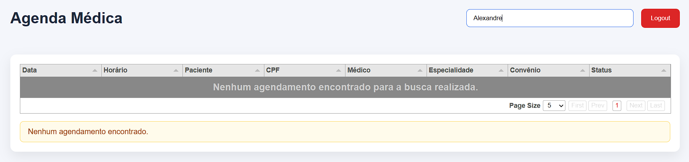

# 🏥 Agenda Médica

> Desafio técnico desenvolvido utilizando **Python + Flask + SQLite + React (Vite)** em arquitetura **Monorepo**, com integração entre serviços via HTTP e execução completa através do Docker.

---

## 📌 Objetivo

Esta aplicação foi desenvolvida para atender aos requisitos do desafio técnico proposto, simulando um sistema simples de Agenda Médica.

O sistema permite:

- Autenticação de usuários utilizando SQLite;
- Consulta de agendamentos através de uma API HTTP;
- Busca de pacientes, CPF ou médico;
- Exibição dos dados em tabela utilizando Tabulator;
- Tratamento de falhas e cenários de erro;
- Execução completa via Docker Compose.

---

# 🚀 Tecnologias Utilizadas

## Backend

- Python 3
- Flask
- Flask SQLAlchemy
- SQLite
- Requests
- Werkzeug

## Frontend

- React
- Vite
- TypeScript
- Axios
- Tabulator

## DevOps

- Docker
- Docker Compose

---

# 📁 Estrutura do Projeto

```text
agenda-medica
│
├── apps
│   │
│   ├── api
│   │   ├── app
│   │   ├── instance
│   │   ├── Dockerfile
│   │   ├── requirements.txt
│   │   ├── run.py
│   │   └── seed.py
│   │
│   ├── mock-api
│   │   ├── app
│   │   ├── data
│   │   ├── Dockerfile
│   │   └── run.py
│   │
│   └── web
│       ├── src
│       ├── package.json
│       └── vite.config.ts
│
├── data
│
├── docker-compose.yml
│
└── README.md
```

---

# 🏗 Arquitetura

```text
               React + Vite
                     │
                     │ HTTP
                     ▼
             Flask API Principal
                     │
         ┌───────────┴────────────┐
         │                        │
         ▼                        ▼
     SQLite                 Mock API
 (Usuários/Login)      (Agendamentos)
```

A API principal é responsável pela autenticação dos usuários e pela integração com uma API externa simulada (Mock API), conforme solicitado no desafio.

---

# ⚙️ Pré-requisitos

Para executar localmente é necessário possuir instalado:

- Python 3
- Node.js
- Docker Desktop
- Docker Compose

---

# ▶️ Executando Localmente

## 1 - API

```bash
cd apps/api

python -m venv .venv

# Windows
.venv\Scripts\activate

pip install -r requirements.txt

python seed.py

python run.py
```

---

## 2 - Mock API

```bash
cd apps/mock-api

python -m venv .venv

# Windows
.venv\Scripts\activate

pip install -r requirements.txt

python run.py
```

---

## 3 - Frontend

```bash
cd apps/web

npm install

npm run dev
```

---

# 🐳 Executando com Docker

Na raiz do projeto:

```bash
docker compose up --build
```

Após iniciar os containers, execute o seed do banco:

```bash
docker exec -it agenda-api python seed.py
```

---

# 👤 Usuário para Testes

```
Login:

admin@agenda.com
```

```
Senha:

123456
```

---

# 🌐 Endpoints

## Login

```
POST /api/login
```

Body:

```json
{
  "login": "admin@agenda.com",
  "password": "123456"
}
```

---

## Buscar Agendamentos

```
GET /api/appointments
```

---

## Buscar por termo

```
GET /api/appointments?search=maria
```

Também aceita:

- CPF
- Médico

---

# 🔎 Funcionalidades

- Login utilizando SQLite
- Autenticação por usuário ou e-mail
- Consulta HTTP entre APIs
- Busca por paciente
- Busca por CPF
- Busca por médico
- Paginação
- Ordenação de colunas
- Layout responsivo da tabela
- Logout
- Docker Compose
- Variáveis de ambiente
- Logs estruturados

---

# ⚠️ Tratamento de Erros

A aplicação trata os seguintes cenários:

- Login inválido
- Usuário inexistente
- Senha inválida
- Nenhum agendamento encontrado
- API de agendamentos indisponível
- Resposta inválida da API
- Campos obrigatórios ausentes
- Erro de conexão com banco de dados
- Tratamento de exceções inesperadas

Todos os erros retornam mensagens amigáveis ao usuário e são registrados em logs para facilitar a identificação da causa.

---

# 📸 Capturas de Tela

## Login


---

## Agenda Médica


---

## Busca

## 

## Nenhum Resultado

## 

# 💡 Decisões Técnicas

Durante o desenvolvimento foram adotadas algumas decisões para aproximar o projeto de um ambiente real:

- Arquitetura em Monorepo.
- Separação entre API principal e Mock API.
- Organização por camadas (Routes, Services, Models e Utils).
- Padronização das respostas HTTP.
- Centralização do tratamento de exceções.
- Utilização de variáveis de ambiente.
- Dockerização dos serviços.
- Frontend desacoplado consumindo apenas a API principal.
- Validação da resposta recebida da Mock API antes da exibição dos dados.

---

# 📋 Requisitos Atendidos

## Parte 1

- ✅ Tela de Login
- ✅ Validação utilizando SQLite
- ✅ Seed do banco
- ✅ Integração HTTP
- ✅ API simulada
- ✅ Tabela utilizando Tabulator
- ✅ Busca por paciente
- ✅ Busca por CPF
- ✅ Busca por médico
- ✅ Docker
- ✅ Docker Compose
- ✅ Variáveis de ambiente

---

## Parte 2

- ✅ Credenciais inválidas
- ✅ Nenhum agendamento encontrado
- ✅ API indisponível
- ✅ Resposta inválida da API
- ✅ Campos obrigatórios ausentes
- ✅ Erro de conexão com banco de dados
- ✅ Logs para diagnóstico

---

# 🚀 Melhorias Futuras

- JWT para autenticação.
- Refresh Token.
- Cadastro de usuários.
- Cadastro de agendamentos.
- Exclusão e edição de consultas.
- Testes automatizados.
- Pipeline de CI/CD.
- Deploy em ambiente cloud.

---

# 👨‍💻 Autor

**Alexandre Gaia**

LinkedIn:

https://www.linkedin.com/in/alexandregaiaa/
