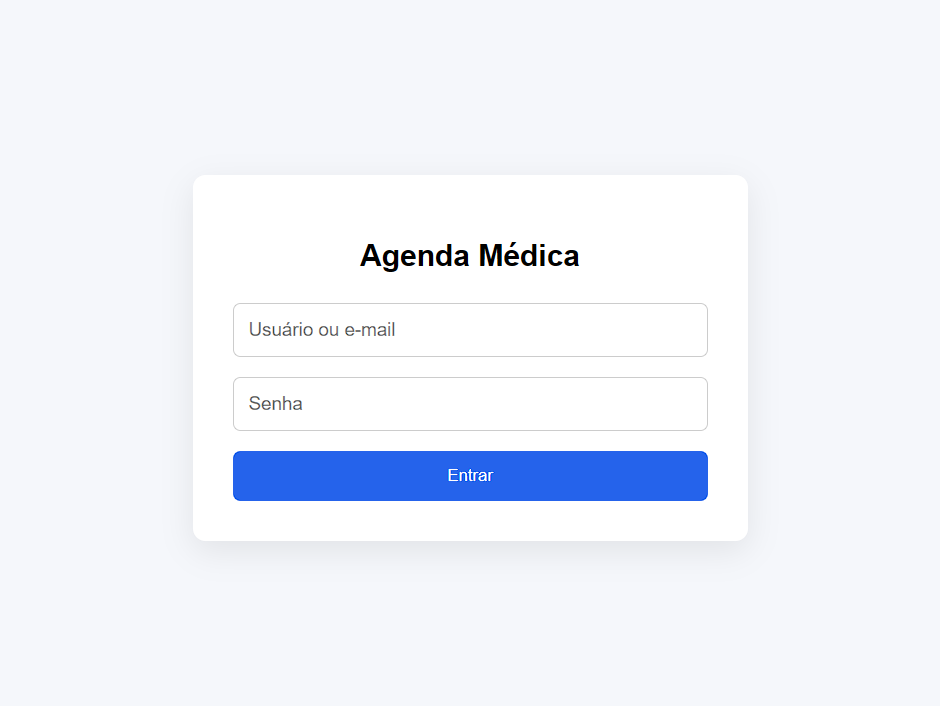
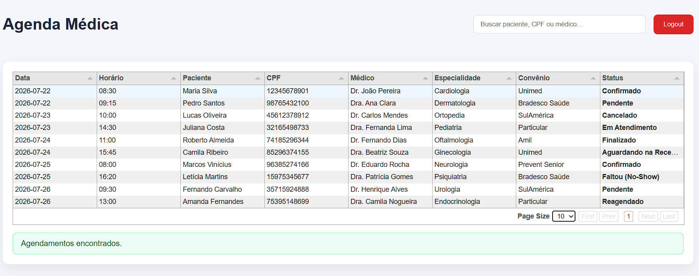
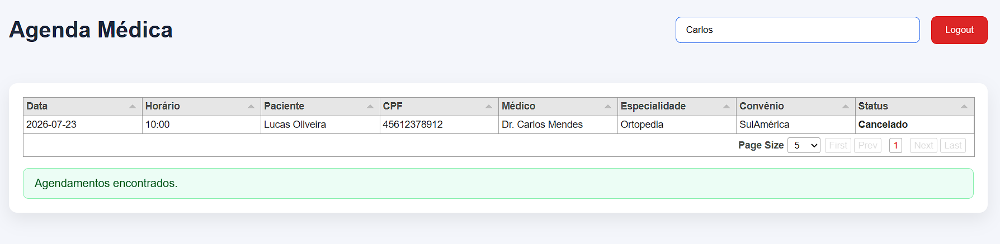

# 🏥 Agenda Médica - Desafio Técnico Full Stack

> Aplicação desenvolvida para desafio técnico utilizando **Python + Flask + SQLite + React (Vite)** em arquitetura **Monorepo**, com integração entre serviços via HTTP e execução completa através do Docker Compose.

---

# 🚀 Começando

Clone o repositório:

```bash
git clone https://github.com/alexandregaiaa/agenda-medica.git

cd agenda-medica
```

A aplicação pode ser executada de duas formas:

- Docker Compose (recomendado)
- Execução manual dos serviços

---

# 📌 Objetivo

Esta aplicação foi desenvolvida para atender aos requisitos de um desafio técnico, simulando um sistema simples de **Agenda Médica**.

O sistema permite:

- Autenticação de usuários utilizando SQLite;
- Consulta de agendamentos através de API HTTP;
- Integração com API externa simulada;
- Busca de pacientes, CPF ou médico;
- Exibição dos dados em tabela utilizando Tabulator;
- Tratamento de falhas e cenários de erro;
- Execução completa via Docker Compose.

---

# 🚀 Tecnologias Utilizadas

## Backend

- Python 3
- Flask
- Flask SQLAlchemy
- SQLite
- Requests
- Werkzeug

## Frontend

- React
- Vite
- TypeScript
- Axios
- Tabulator

## DevOps

- Docker
- Docker Compose

---

# 📁 Estrutura do Projeto

```text
agenda-medica

│
├── apps
│
│   ├── api
│   │   ├── app
│   │   ├── instance
│   │   ├── Dockerfile
│   │   ├── requirements.txt
│   │   ├── run.py
│   │   └── seed.py
│
│   ├── mock-api
│   │   ├── app
│   │   ├── data
│   │   ├── Dockerfile
│   │   └── run.py
│
│   └── web
│       ├── src
│       ├── package.json
│       └── vite.config.ts
│
├── data
│
├── docker-compose.yml
│
└── README.md
```

---

# 🏗 Arquitetura

```text
                React + Vite
                     │
                     │ HTTP
                     ▼
             Flask API Principal
                     │
        ┌────────────┴────────────┐
        │                         │
        ▼                         ▼
     SQLite                  Mock API
 (Usuários/Login)       (Agendamentos)
```

## Fluxo da Aplicação

1. Usuário acessa o Frontend React.
2. Usuário informa suas credenciais.
3. Frontend envia autenticação para a API Flask.
4. API valida o usuário utilizando SQLite.
5. Usuário autenticado consulta os agendamentos.
6. API principal realiza integração HTTP com a Mock API.
7. Dados são tratados e enviados ao Frontend.
8. React renderiza os resultados utilizando Tabulator.

A API principal é responsável pela autenticação e integração com a API simulada de agendamentos.

---

# ⚙️ Pré-requisitos

Para executar localmente é necessário possuir:

- Python 3
- Node.js
- Docker Desktop
- Docker Compose

---

# 🔐 Variáveis de Ambiente

A aplicação utiliza variáveis de ambiente para configuração dos serviços.

Exemplo:

```env
DATABASE_URL=sqlite:///database.db
MOCK_API_URL=http://mock-api:5001
SECRET_KEY=secret
```

As configurações são carregadas sem necessidade de alteração no código fonte.

---

# 🐳 Executando com Docker

Na raiz do projeto:

```bash
docker compose up --build
```

Após iniciar os containers, execute o seed do banco:

```bash
docker exec -it agenda-api python seed.py
```

---

# 🌐 Acessos

Após iniciar a aplicação:

| Serviço       | URL                   |
| ------------- | --------------------- |
| Frontend      | http://localhost:5173 |
| API Principal | http://localhost:5000 |
| Mock API      | http://localhost:5001 |

---

# ▶️ Executando Localmente

## 1 - API Principal

```bash
cd apps/api

python -m venv .venv
```

Windows:

```bash
.venv\Scripts\activate
```

Instalação das dependências:

```bash
pip install -r requirements.txt
```

Inicialização do banco:

```bash
python seed.py
```

Executar API:

```bash
python run.py
```

---

## 2 - Mock API

```bash
cd apps/mock-api

python -m venv .venv
```

Windows:

```bash
.venv\Scripts\activate
```

Instalação:

```bash
pip install -r requirements.txt
```

Executar:

```bash
python run.py
```

---

## 3 - Frontend

```bash
cd apps/web

npm install

npm run dev
```

---

# 👤 Credenciais de Teste

| Campo | Valor                                       |
| ----- | ------------------------------------------- |
| Login | [admin@agenda.com](mailto:admin@agenda.com) |
| Senha | 123456                                      |

---

# 🌐 Endpoints

## Login

```
POST /api/login
```

Body:

```json
{
  "login": "admin@agenda.com",
  "password": "123456"
}
```

Resposta:

```json
{
  "message": "Login realizado com sucesso",
  "user": {
    "email": "admin@agenda.com"
  }
}
```

---

## Buscar Agendamentos

```
GET /api/appointments
```

Resposta:

```json
[
  {
    "patient": "Maria Silva",
    "cpf": "12345678900",
    "doctor": "Dr. João",
    "date": "2026-07-21"
  }
]
```

---

## Buscar por termo

```
GET /api/appointments?search=maria
```

Também aceita busca por:

- CPF
- Médico

---

# 🔎 Funcionalidades

- Login utilizando SQLite
- Autenticação por usuário ou e-mail
- Consulta HTTP entre APIs
- Busca por paciente
- Busca por CPF
- Busca por médico
- Paginação
- Ordenação de colunas
- Layout responsivo da tabela
- Logout
- Docker Compose
- Variáveis de ambiente
- Logs estruturados

---

# ⚠️ Tratamento de Erros

A aplicação trata os seguintes cenários:

- Login inválido
- Usuário inexistente
- Senha inválida
- Nenhum agendamento encontrado
- API de agendamentos indisponível
- Resposta inválida da API
- Campos obrigatórios ausentes
- Erro de conexão com banco de dados
- Exceções inesperadas

Todos os erros retornam mensagens amigáveis ao usuário e são registrados em logs para facilitar diagnóstico.

---

# 📸 Capturas de Tela

## Login



---

## Agenda Médica



---

## Busca



---

## Nenhum Resultado


---

# 💡 Decisões Técnicas

Durante o desenvolvimento foram adotadas algumas decisões para aproximar o projeto de um ambiente real:

- Arquitetura em Monorepo;
- Separação entre API principal e Mock API;
- Organização por camadas (Routes, Services, Models e Utils);
- Padronização das respostas HTTP;
- Centralização do tratamento de exceções;
- Utilização de variáveis de ambiente;
- Dockerização dos serviços;
- Frontend desacoplado consumindo apenas a API principal;
- Validação da resposta recebida da Mock API antes da exibição dos dados.

---

# 📋 Requisitos Atendidos

## Parte 1

- ✅ Tela de Login
- ✅ Validação utilizando SQLite
- ✅ Seed do banco
- ✅ Integração HTTP
- ✅ API simulada
- ✅ Tabela utilizando Tabulator
- ✅ Busca por paciente
- ✅ Busca por CPF
- ✅ Busca por médico
- ✅ Docker
- ✅ Docker Compose
- ✅ Variáveis de ambiente

---

## Parte 2

- ✅ Credenciais inválidas
- ✅ Nenhum agendamento encontrado
- ✅ API indisponível
- ✅ Resposta inválida da API
- ✅ Campos obrigatórios ausentes
- ✅ Erro de conexão com banco de dados
- ✅ Logs para diagnóstico

---

# 🚀 Melhorias Futuras

- JWT para autenticação
- Refresh Token
- Cadastro de usuários
- Cadastro de agendamentos
- Exclusão e edição de consultas
- Testes automatizados
- Pipeline de CI/CD
- Deploy em ambiente cloud

---

# 👨‍💻 Autor

**Alexandre Gaia**

LinkedIn:

https://www.linkedin.com/in/alexandregaiaa/
